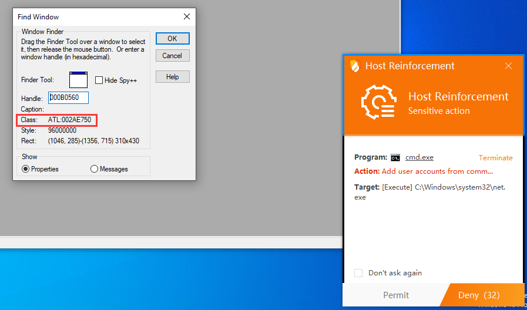
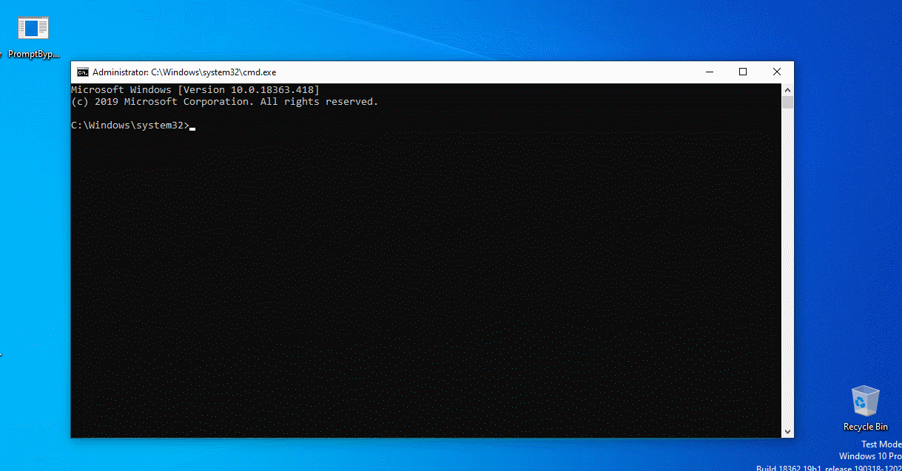

# 绕过防御提示

## 描述

这个方法比较简单，仅仅是通过`SendMessage`函数模拟鼠标在弹窗上按下“允许”按钮。在一些安全性要求高的窗口（比如Windows的UAC弹窗）是会防止以这种方式对其进行操作的，不过火绒可能疏忽了这一点。

源码: [PromptBypass.c](/PromptBypass.c)

# Bypass Protection Prompt

## Description

This is a simple method. Just use `SendMessage` function to simulate mouse button click on the "Allow" button on the prompt. For some security-demanding windows (e.g. Windows UAC Prompt), they prevent this method from manipulating them. However, Huorong might have neglected this point.

Source code: [PromptBypass.c](/PromptBypass.c)

# 分析 / Analysis

 火绒提示窗口及其窗口类名 / Huorong Prompt Window and its window class name  

我的程序只需要找到这个窗口，然后往预先计算好的“允许”按钮的位置模拟鼠标按键就可以代用户按下“允许”。

My program just needs to find this window and simulate mouse button click at the calculated "Allow" button position to click it for the user.

# 效果 / Effect
